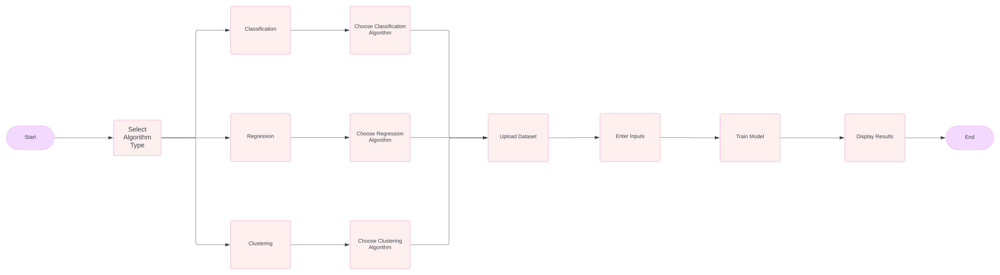
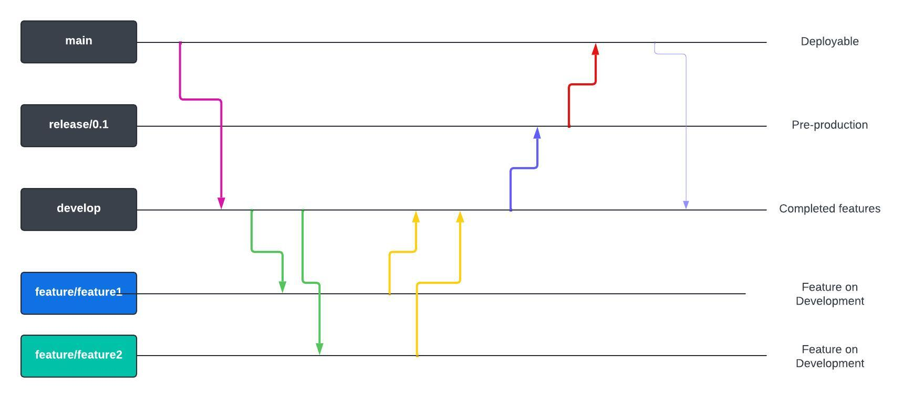

# EXPERT SYSTEM

### *Abstract*

Machine Learning is a vast and complex field that requires a lot of dedication and time to master. 
It is a field where the knowledge of programming languages is essential to implement the algorithms and models. 
But what if we could remove this constraint and allow the users to build models without any coding knowledge? This is where Expert System comes into play. 

Expert System is a platform that allows users to build, train, and test Machine Learning Models without the need for programming languages. 
It provides a user-friendly interface where users can input their data, select the algorithm, and train the model with a click of a button. 
Expert System is designed to make Machine Learning accessible to everyone, regardless of their coding knowledge. 
It aims to democratize Machine Learning and make it easier for people to build and deploy models for their use cases. 
Expert System is built on the principles of simplicity, accessibility, and ease of use. 

With Expert System, Machine Learning is no longer limited to programmers and data scientists. 
It is open to everyone who wants to harness the power of data and build intelligent systems.

### *Development* 



<div style="border: 1px solid red;padding: 15px;">
Status: Linear Regression implemented.
</div>

#### Design

- `home` page should contain a list of Machine Learning models for the user to choose from.
- When a user chooses a model, they should be redirected to `model` page for that particular ML model. 
- Each `model` page must contain fields for user to upload the **Train Set** as well as the **Test Set**.
- Also add fields for additional user inputs based on the model.
- **Data Visualization**: (Optional) the properties of the data is graphically displayed.
- **Data Preprocessing**: the dataset should undergo multiple checks and processing.
- (Optional) Logs regarding the above computations may be displayed.
- The user faces an error, in case an incompatibility occurs between the data, input and the model. Otherwise, the model is displayed.
- The trained model is evaluated and the results are displayed to the user according to the model and problem type (classification / regression / clustering).

#### 1. First Algorithm

- `Home` page contains a link to `Classification` ✅️
- `Classification` contains a link to `LinearRegression` ✅️
- In `LinearRegression`, there are fields to upload the `train set` and `test set`.
- After submitting the form, it would take us to the next page `Results`. ✅️
- This page should display the results obtained after processing the data and building the model. ✅️
- The page can contain 
    - Actual vs Predicted values ✅️
    - confusion matrix
    - f1_score 
    - accuracy ✅️
    - precision
    - recall etc.

#### 2. Growth 

#### 3. Final Stage


### *Technologies*

1. *Django*: The web interface is built using Django, popular web framework.
3. *Scikit-learn*: Expert System leverages Scikit-learn, a popular Machine Learning library in Python, to implement the algorithms and models.
4. *Pandas*, *Numpy*: Powerful data manipulation libraries in Python, to handle the input data.
5. *Matplotlib*: A popular plotting library in Python, to visualize the data and results.

### CI/CD Pipeline

Github Actions is used to automate the developer workflow:
**Development**, **Testing**, **Build** and **Deployment**.



> Github Actions **Listen** to Github **Events**, such as a PR, Contributor addition etc.
> The Event **Triggers a Workflow**, which contain **Actions**, for example Sorting, Labelling, Assignment to someone etc.

```yml
name: Django CI

# Github Events that triggers the workflow
on: 
  push:
    branches: [ "main" ] 
  pull_request:
    branches: [ "main" ] # Any push / pull request to main branch

jobs: # A group of Actions
  build: # Name of the job

    runs-on: ubuntu-latest # OS
    strategy:
      max-parallel: 4
      matrix: # To use mulitple versions of python
        python-version: [3.9]

    steps: # Run commands / setup tasks / actions
    - uses: actions/checkout@v4 # Use 'checkout' action from github
    - name: Set up Python ${{ matrix.python-version }}
      uses: actions/setup-python@v3
      with:
        python-version: ${{ matrix.python-version }}
    - name: Install Dependencies
      run: | # Run the commands
        python -m pip install --upgrade pip
        pip install -r requirements.txt
    - name: Run Tests
      run: | # Test the code
        python manage.py test
```

### *Usage*

Clone the project:
```
git clone https://github.com/akshay-rajan/expertsystem.git
```
Navigate to the project directory:
```
cd expertsystem
```
Create a virutal environment:
```bash
python -m venv myenv
```
Activate the virtual environment:
```bash
source myenv/bin/activate # Linux/macOS
.\myenv\Scripts\activate # Windows
```
Install the requirements:
```bash
pip install -r requirements.txt
```
Start the Django server:
```bash
python manage.py runserver
```
The application is now available at http://127.0.0.1:8000/ .


---

> **Akshay R**,
>*Semester 3, Masters in Computer Applications*,
>*College of Enginnering, Trivandrum*
>(*2023-2025*)