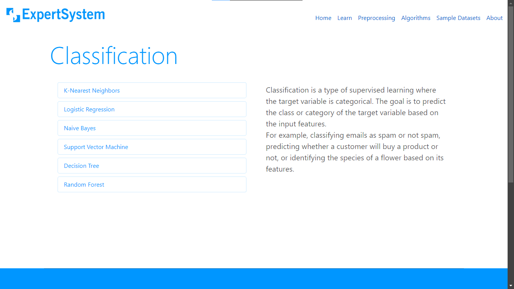

Machine Learning is a vast and complex field that requires a lot of dedication and time to master. 
However, the complexity of ML algorithms and the necessity for programming skills create
significant barriers for individuals who wish to leverage ML for their projects or research. 
But what if we could remove this constraint and allow the users to build models without any coding knowledge?

**Expert System** is a platform that allows users to build, train, and test Machine Learning Models without the need for programming languages. 

It provides a user-friendly interface where users can:





And finally, see the 


in just a few clicks.

Expert System is designed to make Machine Learning accessible to everyone, regardless of their coding knowledge. 

### Flow


### *Technologies Used*


### CI/CD Pipeline

Github Actions is used to automate the developer workflow:
**Development**, **Testing**, **Build** and **Deployment**.


[django.yml](.github/workflows/django.yml)

<!-- > Github Actions **Listen** to Github **Events**, such as a PR, Contributor addition etc. -->
<!-- > The Event **Triggers a Workflow**, which contain **Actions**, for example Sorting, Labelling, Assignment to someone etc. -->
<!-- [django.yml](.github/workflows/django.yml) -->

### *Usage*

Clone the project:
```
git clone https://github.com/akshay-rajan/expertsystem.git
```
Navigate to the project directory:
```
cd expertsystem
```
Create a virutal environment:
```bash
python -m venv myenv
```
Activate the virtual environment:
```bash
source myenv/bin/activate # Linux/macOS
.\myenv\Scripts\activate # Windows
```
Install the requirements:
```bash
pip install -r requirements.txt
```
Run the database migrations:
```bash
python manage.py migrate
```
Start the Django server:
```bash
python manage.py runserver
```
The server will start at http://127.0.0.1:8000/ .


---

<a href="https://github.com/akshay-rajan/expertsystem/graphs/contributors">
  
</a>

> **Akshay R**,
>**Deepu Joseph**,
>*Semester 3, Masters in Computer Applications*,
>*College of Enginnering, Trivandrum*
>(*2023-2025*)

